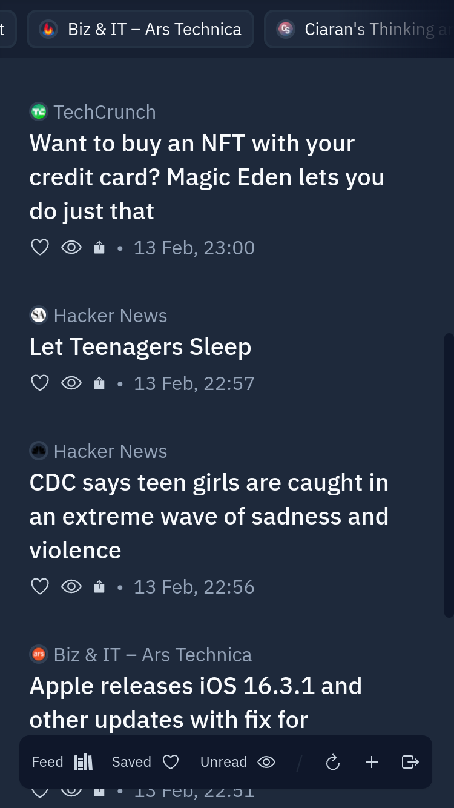

# RAG Feed Reader

Roll-your-own rag! No ads or no paywalls. Visit [RAG](https://rag.ciaran.co.za/) to try it out.

> Inspired by [Newsboat](https://github.com/newsboat/newsboat/). 

I wanted an RSS reader for the browser that sleek, and that would let me read articles without always having to visit the website they're from. Using Go for Lambda Functions, [Supabase](https://supabase.com/) for storage, and Next.js for the frontend, RAG was born.

Some features include:
- Sign-in without a password using magic links
- Install as a mobile app from the website ([`next-pwa`](https://www.npmjs.com/package/next-pwa))
- Save your favourite articles with a ❤️
- Bypass website paywalls thanks to [`go-readability`](https://github.com/go-shiori/go-readability)

## Project Structure

- `/src` - NextJS Front-End
- `/api` - Go backend functions hosted on Vercel
- `/parse` - Go Package for Managing / Parsing XML Feeds
- `/graphql` - GraphQL queries for the front-end

## TO-DO

There are still a number of outstanding features / refactors to complete:

- Atom parsing is still hit-and-miss. There are some websites which simply won't parse.
- Refresh the client automatically when articles are refreshed.
- Scroll-based pagination

Contributions are welcome!

## Licensing

RAG is distributed under MIT license, which means you can use and modify it however you want. If you have any ideas, improvements, etc. - please feel free to make apull request.
